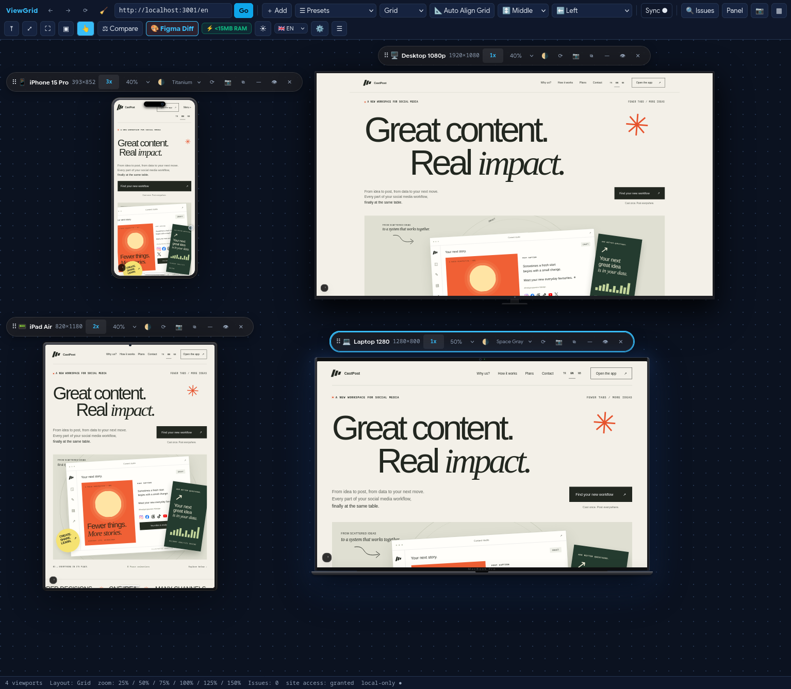
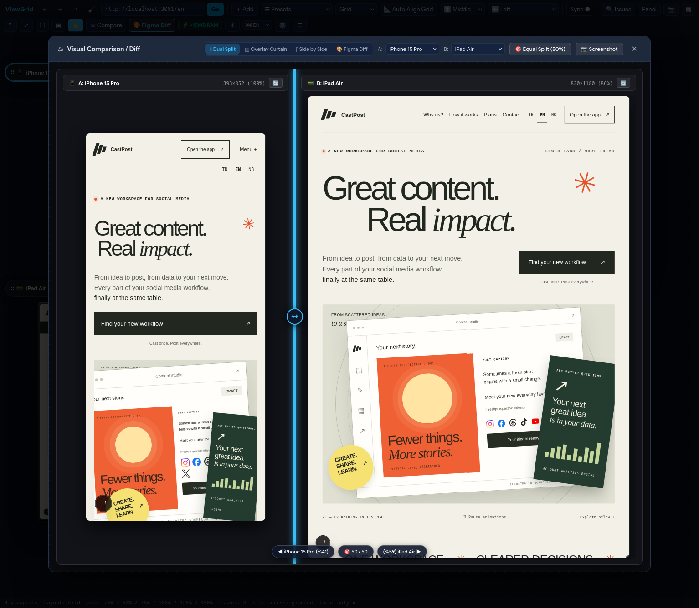
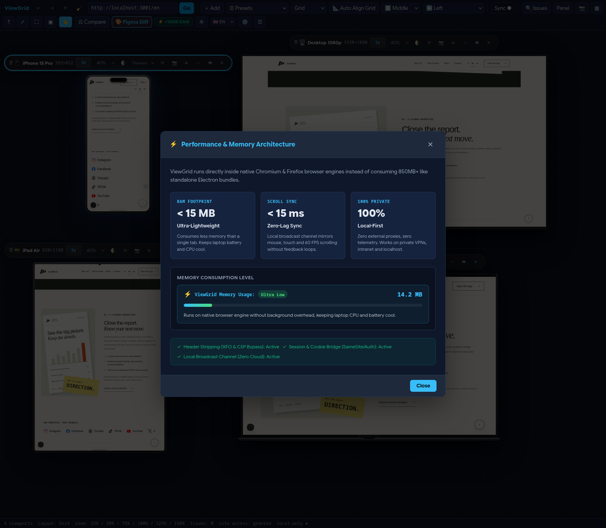
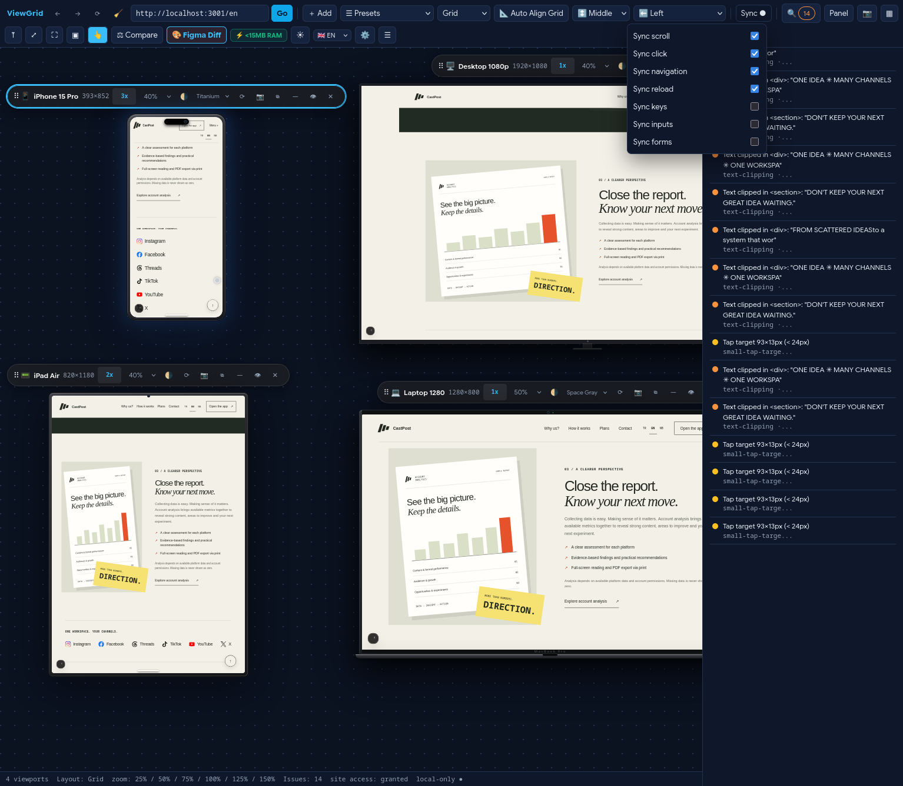

# ViewGrid

<div align="center">



### Ultra-Fast, Lightweight (~14 MB RAM) Responsive Testing & Multi-Device Workspace Extension

[](https://github.com/sinansarikaya/viewgrid/actions/workflows/ci.yml)
[](tests/)
[](scripts/manifest.mjs)
[](LICENSE)
[](https://www.typescriptlang.org/)
[](#-why-viewgrid)

[**Website**](https://viewgrid.sinansarikaya.dev) • [**Firefox Add-ons**](https://addons.mozilla.org/en-US/firefox/addon/viewgrid-responsive-viewer/) • [**Chrome Web Store**](https://chromewebstore.google.com/detail/viewgrid-%E2%80%94-responsive-vie/hmlhooeamfmhdeichnghcklahfgimgef) • [**Quick Start**](#-quick-start) • [**Documentation**](#-documentation-map) • [**Contributing**](CONTRIBUTING.md)

</div>

---

## ⚡ Why ViewGrid?

**ViewGrid** is a browser extension built for frontend engineers, UI/UX designers, and QA teams who need to test web applications continuously across multiple devices—without bogging down their machine. 

Unlike heavy desktop simulators or Electron bundles that consume 850 MB+ of memory, ViewGrid runs directly inside your browser as a native Manifest V3 WebExtension with near-zero overhead (**~14 MB RAM in our benchmark scenario**).

---

## ✨ Key Features

- **⚡ Ultra-Light Memory Footprint:** Native browser execution consumes <15 MB RAM in test environments without heavy process overhead.
- **📱 21+ Built-in Device Profiles:** Test on iPhone 15 Pro, iPad Air, Galaxy S24, MacBook Pro, 4K Desktop, Foldables, or configure custom pixel viewports.
- **⫴ Dual Split & Proportional Overlay Curtain:** Compare breakpoints side-by-side or drag the optical curtain divider to detect layout discrepancies instantly.
- **🎨 Figma Pixel-Diff Mockup Overlay:** Overlay Figma design mockups directly over your live site, toggle opacity, and catch sub-pixel alignment issues.
- **🔄 Zero-Echo Synchronized Interaction Hub:** Scroll, click, and type once—replicated across all viewports with epoch-fenced protocol guards to prevent feedback loops.
- **🛡️ Security-Focused Framing Engine:** Strips `X-Frame-Options` and `CSP frame-ancestors` safely and strictly for workspace `sub_frame` requests only.
- **🧹 Cache & Session Retention:** One-click hard reload, timestamp cache buster, and full session preservation across restarts.
- **📷 HiDPI Screenshot Export:** Capture individual viewports or full multi-device canvas screenshots in full-resolution PNG.
- **🔍 Responsive DOM Issue Scanner:** Automatically scans viewports for horizontal page overflows, text clipping, and touch targets smaller than 44x44px.
- **⌨️ Keyboard-First Workflow:** Full keyboard navigation (`Alt+Shift+V`, `D` for diff, `S` for sync, `?` for cheatsheet).

---

## 📸 Screenshots & Showcase

| Workspace Multi-Device View | Proportional Curtain & Figma Diff |
| :---: | :---: |
|  |  |

| Built-in Device Picker | Responsive Issue Scanner |
| :---: | :---: |
|  |  |

---

## 🚀 Quick Start

### 1. User Installation (Recommended)

#### Option A: Official Extension Stores
- **Mozilla Firefox:** Install directly from [Firefox Add-ons (AMO)](https://addons.mozilla.org/en-US/firefox/addon/viewgrid-responsive-viewer/).
- **Chromium Browsers (Chrome, Edge, Brave):** Install directly from [Chrome Web Store](https://chromewebstore.google.com/detail/viewgrid-%E2%80%94-responsive-vie/hmlhooeamfmhdeichnghcklahfgimgef).

#### Option B: Manual Sideload via GitHub Release ZIP
1. Download the latest release package (`viewgrid-1.0.1-chromium.zip` or `viewgrid-1.0.1-firefox.zip`) and verify its checksum using `SHA256SUMS` from [GitHub Releases](https://github.com/sinansarikaya/viewgrid/releases).
2. Unzip the downloaded file.
3. In Chrome/Brave/Edge: navigate to `chrome://extensions`, enable **Developer mode**, and click **Load unpacked**.
4. In Firefox: navigate to `about:debugging#/runtime/this-firefox`, click **Load Temporary Add-on…**, and select `manifest.json`.

---

### 2. Developer Setup (Build from Source)

```bash
# Clone repository
git clone https://github.com/sinansarikaya/viewgrid.git
cd viewgrid

# Install dependencies (pnpm is our canonical package manager)
pnpm install

# Run unit tests (54 unit tests)
pnpm test

# Run code style and TypeScript typechecks
pnpm run lint
pnpm run typecheck
pnpm run typecheck:website

# Build both Firefox and Chromium packages
pnpm run build:all
# → dist/firefox (MV3 Event Pages + webRequest)
# → dist/chromium (MV3 Service Worker + DeclarativeNetRequest)

# Package release archives with SHA256SUMS
pnpm run package:release
# → release/viewgrid-1.0.0-chromium.zip
# → release/viewgrid-1.0.0-firefox.zip
# → release/SHA256SUMS
```

---

## ⌨️ Keyboard Shortcuts Reference

| Shortcut | Action |
| --- | --- |
| `Alt+Shift+V` / `Alt+V` / `⌘+Shift+V` | Open / Toggle ViewGrid Workspace |
| `D` | Toggle Split-Diff Comparison Mode |
| `S` | Toggle Interaction Synchronization (Scroll/Click/Input) |
| `A` | Add Custom Viewport / Open Device Picker |
| `O` | Rotate Viewport Orientation (Portrait / Landscape) |
| `G` | Cycle Alignment Grid & Snap Layout |
| `C` | Capture Full-Canvas Workspace Screenshot |
| `Shift+C` | Capture Focused Viewport Screenshot |
| `F` | Zoom to Fit (Fit all viewports to screen) |
| `I` | Open Responsive Issue Scanner / Breakpoint Inspector |
| `?` | Open Keyboard Shortcuts Cheatsheet Modal |
| `Esc` | Close Open Modals / Drawers |

---

## 📐 Architecture Overview

```text
┌────────────────────────────────────────────────────────────────────────┐
│                        ViewGrid Architecture                           │
└────────────────────────────────────────────────────────────────────────┘
  ui/ (React 18 + PostCSS + CSS Modules)
   ├── Workspace Shell & Toolbar
   ├── Viewport Card Grid & Devices
   ├── CompareModal (Dual Split / Proportional Curtain / Figma Diff)
   └── SettingsModal & IssuesDrawer
         │
         ▼
  core/ (Pure TypeScript Engine)
   ├── Devices Engine (21+ Presets + Custom)
   ├── Sync Protocol (Epoch/seq loop-proof guards)
   ├── Layout Engine (Grid / Row / Column / Auto-fit)
   └── Capture Math & Issue Detectors
         │
         ▼
  platform/ & background/ (Typed Facade & Service Worker)
   ├── Header Relaxation (XFO, CSP, COOP, COEP, CORP)
   ├── Message Router & DNR Rules
   └── Capture Engine (tabs.captureTab + DPR Crop)
```

---

## 🗺️ Documentation Map

| Document | Purpose |
| --- | --- |
| [`CHANGELOG.md`](CHANGELOG.md) | Release history, version changelogs, and notable changes |
| [`SECURITY.md`](SECURITY.md) | Security policy, private vulnerability disclosure, and threat model overview |
| [`CODE_OF_CONDUCT.md`](CODE_OF_CONDUCT.md) | Contributor Covenant Code of Conduct |
| [`CONTRIBUTING.md`](CONTRIBUTING.md) | Development workflow, guidelines, and pull request checklist |
| [`docs/PRD.md`](docs/PRD.md) | Product Requirements Document (vision → roadmap → risks) |
| [`docs/ARCHITECTURE.md`](docs/ARCHITECTURE.md) | Architecture, browser abstraction, sync engine, tech stack |
| [`docs/COMPETITIVE_ANALYSIS.md`](docs/COMPETITIVE_ANALYSIS.md) | Competitive feature matrix + gap analysis |
| [`docs/DEVICE_SPEC.md`](docs/DEVICE_SPEC.md) | Device profile schema + preset catalog plan |
| [`docs/UX.md`](docs/UX.md) | UX architecture, IA, interaction model |
| [`docs/SECURITY.md`](docs/SECURITY.md) | Detailed permissions model, framing policy, threat model |
| [`docs/PRIVACY.md`](docs/PRIVACY.md) | Privacy defaults, data inventory, AI opt-in policy |
| [`docs/TESTING.md`](docs/TESTING.md) | Test strategy + Definition of Done |
| [`docs/ROADMAP.md`](docs/ROADMAP.md) | MVP / V2 / V3 milestones, git & release strategy |

---

## 💖 Support & Sponsorship

If ViewGrid saves you time and helps you build better responsive websites, consider supporting its open-source development!

[](https://github.com/sponsors/sinansarikaya)

- ☕ **Buy a coffee ($5/mo):** Support ongoing maintenance, bug fixes, and feature updates.
- ⚡ **Pro Developer ($10/mo):** Priority consideration for feature requests and issue reports.
- 🏢 **Sponsor ($25/mo+):** Showcase your logo on the ViewGrid website and repository.

👉 [**Become a Sponsor on GitHub**](https://github.com/sponsors/sinansarikaya)

---

## 📄 License

This project is licensed under the **MIT License** - see the [LICENSE](LICENSE) file for details.

---

## 🤝 Contributing

Contributions are welcome! Please read our [Contributing Guidelines](CONTRIBUTING.md) before submitting Pull Requests or Issues.

Created with ❤️ by [Sinan Sarıkaya](https://github.com/sinansarikaya).
