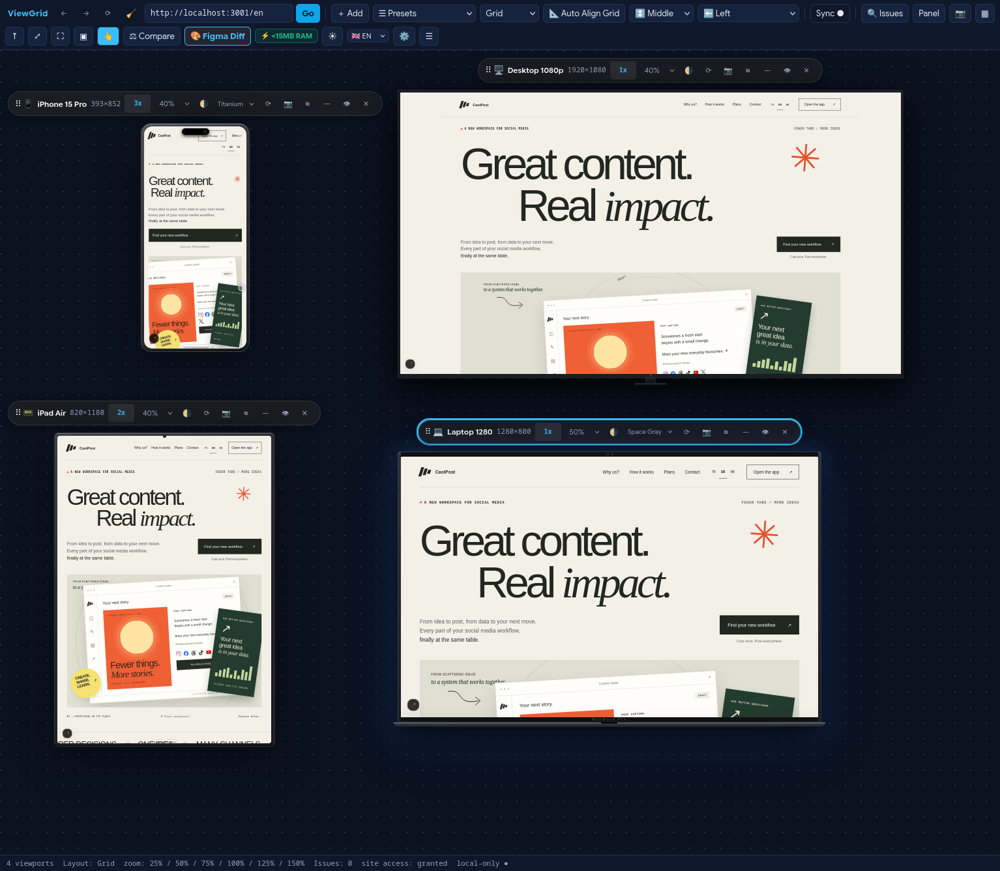

# ViewGrid

**Test responsive layouts side by side in one browser tab.**

ViewGrid is a local browser extension for Chrome/Chromium and Firefox, with synchronized interactions, device profiles, design overlays, screenshots and reviewable responsive findings.

[Website](https://viewgrid.sinansarikaya.dev/) · [Chrome Web Store](https://chromewebstore.google.com/detail/viewgrid-%E2%80%94-responsive-vie/hmlhooeamfmhdeichnghcklahfgimgef) · [Firefox Add-ons](https://addons.mozilla.org/en-US/firefox/addon/viewgrid-responsive-viewer/) · [GitHub releases](https://github.com/sinansarikaya/viewgrid/releases)

## Version 1.0.3

Version 1.0.3 fixes a regression where protected previews stopped loading after their own navigation or reload. Both installable browser builds are included in dist/ and in the source ZIP; manifest versions come from package.json. The Issues panel now distinguishes unique findings from occurrences across devices and provides filters, element highlighting, copy and JSON export. See [CHANGELOG.md](CHANGELOG.md).

GitHub release packages and browser-store submissions are separate distribution channels. The store links above may offer an older version until review is complete.

## Features

- **21 device profiles and 5 preset sets**, custom dimensions, portrait/landscape, zoom, duplication and up to 16 viewports.
- **Grid, row, column and free layouts**, manual ordering, alignment, focus mode, hardware frames and a touch cursor.
- **Synchronized scroll, clicks, navigation, reload, inputs/forms and key events.** Each channel can be toggled independently. Document epochs keep synchronization working after reload. Input events use native setters so controlled React inputs receive changes.
- **Split, curtain and side-by-side comparisons.** Overlay an exported PNG/SVG design with adjustable opacity/blending and preserved aspect ratio. This is a visual overlay, not a Figma API integration or an automated pixel-diff score.
- **PNG screenshots** of one or every expanded viewport at its logical dimensions and the host browser's capture scale. Large viewports are tiled; device frames are excluded. Export is limited to 32 megapixels. Keep the workspace tab active; Escape cancels a capture. The workspace screenshot button captures the currently visible workspace.
- **Responsive issue review** for horizontal overflow, clipped text, out-of-viewport controls and recommended 44×44 CSS-pixel touch targets on touch device profiles.
- **Saved workspaces, custom devices, language and shortcut preferences**, stored locally. English, Turkish and Norwegian UI.

## What does an issue count mean?

A count such as **61** in older releases meant raw detector results across all viewports, including repeats. It did not prove 61 distinct bugs.

Version 1.0.2 and later group findings by page URL, rule and selector. The panel shows **unique findings** and **viewport occurrences** separately. The same element/rule on one device is counted once. Hidden controls, intentionally clipped/scrollable containers, ellipsis and small inline prose links are excluded where detectable.

Use the panel to:

1. Filter by device, rule, severity or search text.
2. Click an affected device to highlight the element on its page.
3. Inspect measured dimensions, selector, page URL and viewport size.
4. Copy a selector, finding or the filtered Markdown report; export filtered JSON.
5. Re-scan after changing the page. Failed frames and the 5,000-element scan limit are shown explicitly.

Findings are **heuristic suggestions**, not confirmed defects or a WCAG conformance audit. Intentional designs can still need manual review; the collector does not traverse shadow roots or nested cross-origin frames. Input values are not included in issue reports.

## Preview security and browser limitations

Framing exceptions are confined to **verified ViewGrid workspace tabs**. Normal browsing tabs retain their protections. Firefox scopes exceptions to direct previews; Chromium scopes them to subframes in the workspace tab, including nested frames, because DNR cannot select a parent frame ID. Obsolete globally scoped rules from 1.0.1 are removed on background initialization.

- **Firefox (Manifest V2, Firefox 128+):** removes X-Frame-Options and only the `frame-ancestors` directive from CSP response headers, preserving other directives and cookies. Firefox MV3 does not permit these headers to be relaxed, so the Firefox package uses MV2.
- **Chromium:** DeclarativeNetRequest cannot rewrite an individual CSP directive. Workspace subframe responses have XFO and CSP headers removed, including during page-initiated navigation and reload; this affects security behavior inside workspace previews and their nested frames. Normal tabs are outside the exception.
- Both browser builds defer worker registration until the preview agent verifies its workspace tab, then disables registration and unregisters workers visible in that preview storage partition. Existing controlled previews reload once after unregistering. Normal tabs are untouched; cookies, localStorage, sessionStorage and CacheStorage are retained. Hard refresh reloads the workspace using the browser's bypass-cache option.
- Third-party cookie policies, sandbox restrictions, service-worker-served responses and login flows can prevent a site from working in an iframe. ViewGrid is not an isolated authentication browser or a substitute for testing security headers in a normal tab.
- Device profiles set CSS viewport dimensions. Their DPR/UA metadata does not emulate real phone hardware, mobile browser engines or network user agents. Synthetic key events reach application handlers but cannot reproduce browser-reserved or trusted default actions.
- Previews load the sites you select and those sites make their usual network requests. ViewGrid has no telemetry or cloud proxy. RAM, frame rate and latency depend on page content, hardware and viewport count; no fixed RAM/FPS guarantee is made.

## Install a GitHub package

For a source checkout or source ZIP, use `dist/chromium` in Chrome and `dist/firefox/manifest.json` in Firefox. Do not select the parent `dist` folder. After updating a local checkout, rebuild with `pnpm run build:all` if needed.

Download the Chromium or Firefox package and `SHA256SUMS` from [Releases](https://github.com/sinansarikaya/viewgrid/releases). Verify checksums before sideloading.

- Chromium: unzip, open `chrome://extensions`, enable Developer mode, choose **Load unpacked**.
- Firefox: unzip, open `about:debugging#/runtime/this-firefox`, choose **Load Temporary Add-on** and select `manifest.json`. Temporary installs disappear after restart; the AMO store supplies signed persistent installs.

## Develop and test

```bash
pnpm install --frozen-lockfile
pnpm run lint
pnpm run typecheck
pnpm run typecheck:website
pnpm test
pnpm run build:all
pnpm run lint:web-ext
pnpm exec playwright install --with-deps chromium
pnpm run test:e2e
pnpm run build:website
pnpm run package:release
```

CI runs unit/DOM integration tests and real Chromium extension flows using a deterministic local fixture, including iframe isolation, reload synchronization, Issues export, complete screenshot dimensions and preview worker isolation. CI also installs the real Firefox extension and checks protected navigation/reload, synchronization, normal-tab isolation and the reported CastPost page. Firefox/ESR and Windows/macOS manual smoke testing remain part of the release checklist.

## Default keyboard shortcuts

| Shortcut | Action |
|---|---|
| `Alt+Shift+V` / macOS `Command+Shift+V` | Open workspace |
| `A` | Device picker |
| `D` / `Shift+D` | Comparison |
| `S` | Toggle sync channels |
| `G` | Cycle grid/row/column |
| `O` | Rotate focused viewport |
| `F` | Focus mode |
| `Shift+F` | Device frames |
| `C` | Focused or first viewport PNG |
| `Shift+C` | Separate PNG for every expanded viewport |
| `Shift+R` | Reload previews |
| `Shift+B` | Reload workspace with bypass-cache |
| `I` | Scan responsive issues |
| `?` | Shortcut help |
| `Escape` | Close panels or cancel capture |

Shortcuts apply while the workspace has focus; editable fields retain typing behavior. Settings allow customization of the listed configurable actions. Use the toolbar's **Fit to screen** control to fit viewports.

## Walkthroughs

[English video](promos/viewgrid-promo-en.mp4) · [Türkçe video](promos/viewgrid-promo-tr.mp4) · [Video details](promos/README.md)

These walkthroughs were produced before 1.0.2. Historical benchmark and framing claims in the videos are superseded by the limitations above.



[Privacy](docs/PRIVACY.md) · [Security](SECURITY.md) · [Testing](docs/TESTING.md) · [MIT License](LICENSE)

Created by [Sinan Sarıkaya](https://github.com/sinansarikaya). [Sponsor ViewGrid](https://github.com/sponsors/sinansarikaya).
